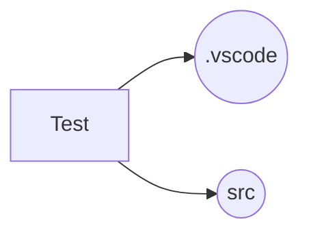

# vscode配置
[toc]
## 关于用户配置和工作区配置
配置文件均为setting.json,作用范围不同
### 用户配置
+ 说明
全局配置文件，作用于当前用户的所有文件夹。
+ 路径
C:\Users\当前用户\AppData\Roaming\Code\User\setting.json
### 工作区配置
+ 说明
局部配置文件，作用于当前文件夹。
+ 路径
当前文件夹\\.vscode\setting.json
## 使用vscode进行Qt相关工作(CMake)
说明:采用CMakeList管理的Qt项目
--- ---
### vscode插件安装
+ CMake v0.0.17
+ CMake Tools v1.18.43
+ C/C++ v1.19.9
以上插件均经过验证，可以使用。在安装插件之前需要确保计算机已经安装C++编译器，CMake构建工具。

### vscode配置文件
以Test工程举例,程序名称Test.exe,编译器采用MSVC（CL）。Test目录下创建.vscode文件夹。工程结构如下：


包含以下配置文件：
+ settings.json
```json
{
    // 用于配置cmake构建属性
    "cmake.sourceDirectory": "${workspaceFolder}/src",
    "cmake.buildDirectory": "${workspaceFolder}/buildsrc"
}
```

+ c_cpp_properties.json(可选)
```json
{
    // 定制一些属性,包含代码头文件目录等
    "configurations": [
        {
            "name": "Win64",
            "includePath": [
                "${workspaceFolder}/**",
                "3rdparty/",
            ],
            "defines": [
                "_DEBUG",
                "UNICODE",
                "_UNICODE"
            ],
            "windowsSdkVersion": "10.0.19041.0",
            "intelliSenseMode": "windows-msvc-x64",
            "cStandard": "c17",
            "cppStandard": "c++17",
            "configurationProvider": "ms-vscode.cmake-tools"
        }
    ],
    "version": 4
}
```

+ launch.json
```json
 {
        // 运行配置文件
            "name": "Test",
            "type": "cppvsdbg",
            "request": "launch",
            "program": "Test.exe",
            "stopAtEntry": false,
            "cwd": "${workspaceFolder}/build", 
            "console": "internalConsole",
            "sourceFileMap": { // 源码映射配置，方便调试源码
                "C:/Users/qt/work/qt": "your qt source code"
            },
            "envFile": "${workspaceFolder}/my.env", // 当前运行环境变量设置
            "preLaunchTask": "testTask"
        }
```
+ task.json(可选)
```json
{
    // See https://go.microsoft.com/fwlink/?LinkId=733558
    // for the documentation about the tasks.json format
    // 设置一些任务区执行，可以在launch.json文件中设置prelaunch属性去执行
    "version": "2.0.0",
    "tasks": [
       {
            "label": "testTask",
            "type": "shell",
            "command": "test.bat",
            "args": [
                "first param",
                "second param",
            ],
            "options": {
                "cwd": "${workspaceFolder}"
            } 
        }
    ]
}
```

+ .env文件(配置当前运行环境变量)
如用到opencv的库，运行时需要加载opencv的dll，可以使用如下配置。
```
Path=D:\develop\installed\opencv-4.5.2-vc16\x64\vc16\bin;
```
## 使用vscode进行Qt相关工作(QMake)
说明:采用Pro文件管理的Qt项目，直接调用qt的QMake命令即可。

## 使用dump文件分析
C/C++插件可以通过配置dump文件路径和pdb文件路径，分析dump文件。
`launch.json`配置如下：
```json
{
    "version": "0.2.0",
    "configurations": [
        {
            "name":"dumpTest",
            "type": "cppvsdbg",
            "request": "launch",
            "program": "test.exe",
            "cwd": "${workspaceFolder}/build", 
            "stopAtEntry": false,
            "dumpPath":"${workspaceFolder}/test.exe.1234.dmp",
            "symbolSearchPath": "${workspaceFolder}/pdbPath",
            "sourceFileMap": {
                "pdbInfoPath": "your source code path",
            },
        }
    ]
}
```
