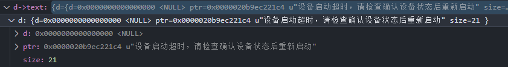

```markdown
对于QString类型设置条件断点，判断字符串匹配条件分析QString的内存结构。

```
QString d;
输入d,!。内存结构显示下图所示


即可通过以下表达式，设置条件断点
d->text.d.ptr && strcmp((const char*)d->text.d.ptr, (const char*)u"设备启动超时，请检查确认设备状态后重新启动") == 0
断点即会在满足字符串等于"设备启动超时，请检查确认设备状态后重新启动"时触发。
后面其他的可以补充
原型稿